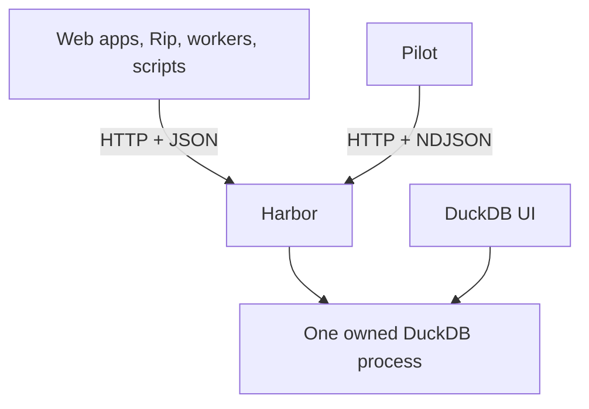

# Harbor vs. Quack: The Sales Pitch

Yes—after reading the current Harbor code and DuckDB's announcement, I think **Harbor + Pilot + UI stacks up extremely nicely**.

The important distinction is:

> Quack makes one DuckDB talk beautifully to another DuckDB.
> Harbor makes DuckDB accessible to practically anything.

That is a genuinely valuable difference.

## One important correction

Quack also travels over HTTP. DuckDB explicitly describes it as an HTTP-based protocol with no custom network transport to operate.

But its HTTP bodies use `application/duckdb`, encoded with DuckDB's internal binary serialization. So the transport is standard HTTP, but the **application protocol is DuckDB-specific**. A non-DuckDB client must implement that serialization, its handshake, fetching behavior, error model, session semantics, and future protocol changes. [DuckDB's Quack documentation](https://duckdb.org/docs/current/quack/overview)

Harbor uses ordinary HTTP plus ordinary JSON/NDJSON:

```http
POST /sql

{"sql":"SELECT * FROM orders"}
```

```json
{"type":"schema","columns":[...]}
{"type":"row","values":[...]}
{"type":"end","rowCount":42,"timeMs":3}
```

That distinction is enormous for application development.

## The real comparison

| Area              | Harbor                                           | Quack + `CONNECT`                            |
| ----------------- | ------------------------------------------------ | -------------------------------------------- |
| Primary client    | Any HTTP-capable program                         | Another DuckDB                               |
| Payload           | JSON/NDJSON                                      | DuckDB binary serialization                  |
| Client dependency | HTTP + JSON parser                               | DuckDB/Quack client implementation           |
| Browser use       | Natural with `fetch()`                           | Specialized client/Wasm integration          |
| Shell use         | `curl` works                                     | DuckDB client required                       |
| Language support  | Effectively universal                            | Bindings or custom protocol implementation   |
| Remote catalog    | SQL endpoint and `/catalog`                      | Native `ATTACH`/`CONNECT` catalog            |
| Type fidelity     | Carefully encoded JSON with type metadata        | Native, fully lossless DuckDB representation |
| Result efficiency | Excellent for app-sized and streaming results    | Better for huge typed analytical transfers   |
| Operations        | Fleet, readiness, shutdown, cancellation, leases | Native DuckDB server/session model           |
| Human client      | Pilot                                            | DuckDB CLI with Quack                        |
| UI                | Matched DuckDB UI served alongside Harbor        | Not the core Quack proposition               |

## Harbor's strongest advantage

Harbor draws the system boundary at exactly the right place:



The application does not care:

* which DuckDB client library exists for its language;
* whether that library matches the server version;
* how to compile or distribute `libduckdb`;
* how DuckDB serializes vectors internally;
* how to implement Quack;
* whether it is running in JavaScript, Rip, Python, a shell script, or something new.

It just sends SQL and reads JSON.

That is especially powerful for your MedLabs/Rip architecture. Your workers already speak HTTP. Harbor lets them remain ordinary stateless application processes while one carefully controlled process owns the database.

Quack would require putting DuckDB—or a credible Quack implementation—on the client side. That is exactly the coupling you are trying to avoid.

## Harbor is considerably more than "DuckDB behind an endpoint"

The code has the hard operational pieces that simplistic SQL-over-HTTP wrappers usually ignore:

* bounded query concurrency;
* streamed results without materializing the complete result;
* lossless metadata for decimals, nested types and oversized integers;
* prepared-statement caching;
* pinned transactional sessions;
* separate worker and session connection capacity;
* client-named query cancellation;
* statement deadlines;
* abandoned-session reclamation;
* readiness that tests the database rather than merely the process;
* graceful drain, checkpoint and shutdown;
* per-database process isolation;
* Unix sockets locally and Caddy at the remote edge;
* sealed mode, memory limits, spill limits and token authentication;
* fleet discovery without introducing a supervising daemon.

The protocol is also deliberately small and versioned. [`wire/src/lib.rs`](https://github.com/shreeve/duckdb-harbor/blob/main/crates/wire/src/lib.rs) shows that clients only need a few request types and four streaming events: `schema`, `row`, `end`, and `error`.

That is a very good protocol.

## Pilot makes the architecture feel complete

Pilot is not merely a demo client. It makes Harbor comfortable for humans:

* DuckDB-style interactive experience;
* syntax highlighting and completion;
* named berths;
* database-path join-or-spawn behavior;
* no DuckDB engine linked into the client;
* version independence across a mixed fleet;
* streaming rendering;
* real Ctrl-C cancellation through Harbor.

The last point is particularly good. Pilot generates a query ID, streams the response, and converts Ctrl-C into `DELETE /sql/queries/<id>`. That is thoughtful client/server behavior, not a superficial CLI wrapper. [`pilot/src/main.rs`](https://github.com/shreeve/duckdb-harbor/blob/main/crates/pilot/src/main.rs)

And the vendored Reedline fixes demonstrate that you have worked through the irritating details that determine whether a REPL actually feels polished.

## The fixed UI rounds out the product

Once the exact matching DuckDB UI extension works against the exact engine Harbor loads, the package becomes:

* **Harbor:** programmatic and operational interface;
* **Pilot:** excellent terminal interface;
* **DuckDB UI:** visual SQL/notebook interface;
* **DuckDB 2.0:** the engine.

That is a coherent database product rather than merely a server experiment.

The version-matching approach is especially defensible: Harbor, `libduckdb`, and the UI extension all derive from the same nightly. You are not pretending DuckDB's current extension ABI problem does not exist—you have made matching deterministic.

## Where Quack is honestly better

Quack has several capabilities Harbor should not try to imitate.

### Native remote catalog semantics

With Quack:

```sql
ATTACH 'quack:server.example.com' AS qk (...);
CONNECT qk;
SELECT * FROM events;
```

The remote database behaves like DuckDB inside DuckDB. DuckDB 2.0 can route whole queries to it and use its remote pushdown optimizer. That is beautiful for federation, analytical composition and DuckDB-to-DuckDB workflows. [DuckDB 2.0 preview](https://duckdb.org/2026/08/17/duckdb-20-highlights)

Harbor intentionally offers remote SQL execution, not transparent catalog federation.

### Binary analytical result transport

Quack preserves DuckDB's full type system without converting through JSON and can transfer native chunks efficiently. For gigantic analytical results moving between DuckDB instances, Quack should win.

Harbor's schema metadata and careful value encoding make JSON safe, but it is still JSON. It will use more bandwidth and CPU for huge results.

### Upstream integration

Quack is becoming a stable, first-party part of DuckDB 2.0. `CONNECT` and the remote optimizer will naturally receive upstream investment and ecosystem support.

That matters—but it does not erase Harbor's market. It clarifies it.

## My conclusion

Your statement is basically right, with one refinement:

> Harbor's advantage is not that Quack fails to use HTTP. Quack does use HTTP. Harbor's advantage is that it uses the **universal HTTP application model**—JSON requests and streaming NDJSON responses—while Quack carries a specialized DuckDB binary protocol over HTTP.

That makes the positioning very clean:

> **Quack connects databases. Harbor connects applications.**

Or, using the excellent language already in your README:

> **Many clients, one DuckDB, over plain HTTP.**

I would not pitch Harbor as "better Quack." That invites a binary-protocol performance comparison in Quack's strongest territory.

I would pitch it as the missing application-facing counterpart:

> DuckDB 2.0 gives DuckDB a native server protocol. Harbor gives every language, browser, worker, script, and application an immediately usable DuckDB service—with no driver and no protocol implementation.

And yes: **Harbor + Pilot + the working UI is now an unusually complete and genuinely compelling package.** Quack does not obsolete it. DuckDB declaring "this is the year of DuckDB as a server" actually validates Harbor's premise—and greatly increases the number of people who will understand why Harbor exists.
