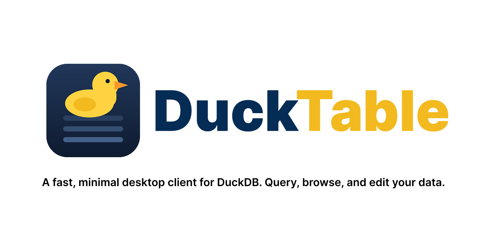
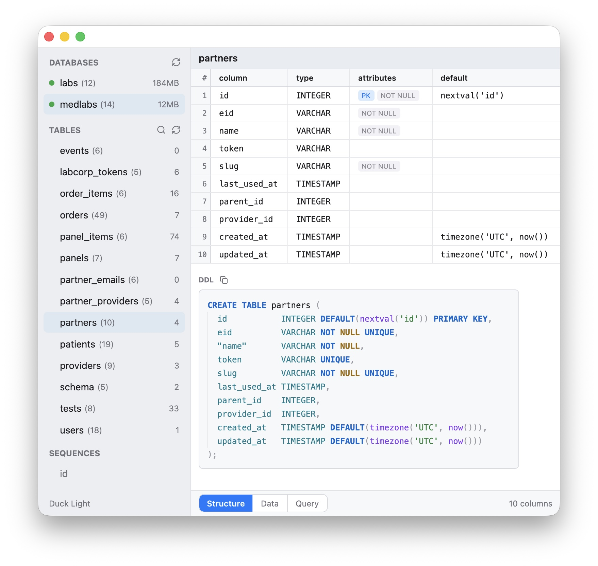
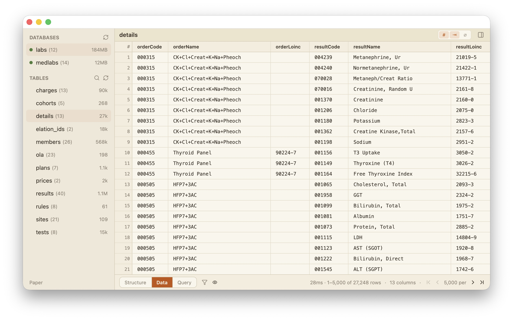
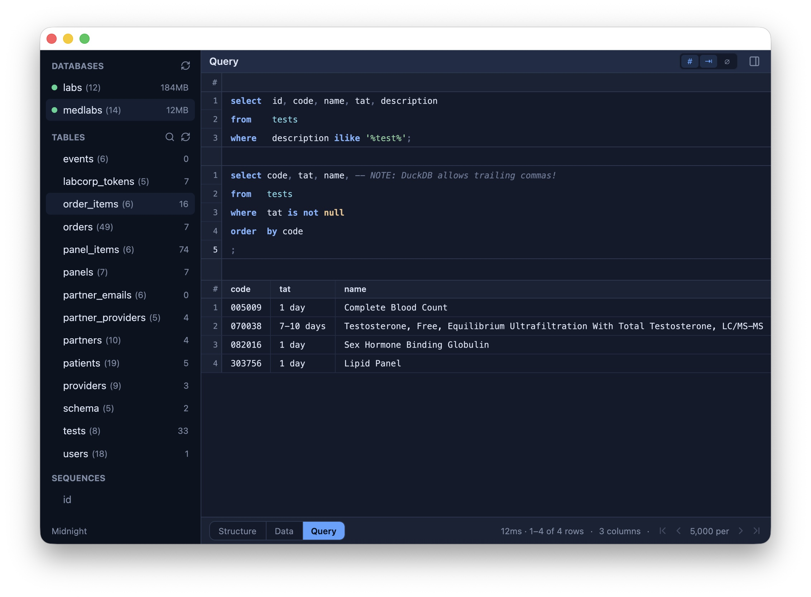

<p align="center">
  
</p>

# DuckTable

> **A fast, minimal desktop client for DuckDB. Query, browse, and edit your
> data. Nothing else.**

DuckTable speaks to [DuckDB Harbor](https://github.com/shreeve/duckdb-harbor)
and requires it. It never links DuckDB, never opens a database file, and never
asks you for a path. You connect to a database by name; Harbor owns the
engine, the files, and the versioning. Local files work through Harbor's
spawn-on-demand, the same way `harbor <file>` opens them.

## Screenshots

One window, three views — and three of the built-in themes. Click any
shot for full resolution.

**Structure** — every column with its type, attributes, and defaults,
and the table's DDL below, drawn as the engine would write it. *(Duck
Light theme.)*

[](docs/shots/01-structure.png)

**Data** — 27k rows paged 5,000 at a time in 28ms, with row numbers,
right-aligned numerics, and NULL tags each one keystroke away. *(Paper
theme.)*

[](docs/shots/02-data.png)

**Query** — a SQL scratchpad above live results. Statements wear bands
in the gutter, line numbers restart per statement to match the engine's
own `LINE n` diagnostics, and ⌘Enter sends the statement under the
caret. *(Midnight theme.)*

[](docs/shots/03-query.png)

## Install

```console
$ curl -fsSL https://raw.githubusercontent.com/shreeve/duckdb-harbor/main/ducktable/scripts/install.sh | bash
```

One command, Apple Silicon, no Gatekeeper dialog — the script drops
`DuckTable.app` into `/Applications` from the latest release. (Downloading
the zip in a browser instead will trip Gatekeeper's quarantine; if you go
that way, allow it under System Settings → Privacy & Security → Open Anyway.)

Uninstall with `... | bash -s -- --uninstall` — the app goes; your settings
(`~/.config/ducktable`) and your databases stay.

On Intel, or to build from source: clone the repo and run
`ducktable/scripts/macos-app.sh release`.

## Databases by port

Choose **File → Open Database URL…** when Harbor is already listening on a TCP
port. Give the database a sidebar name, host, and port. `localhost`
connects directly; any other host makes DuckTable create the SSH tunnel:

```text
Name  Production
Host  foo.bar.com
Port  9494
```

DuckTable asks macOS's `/usr/bin/ssh` to forward an arbitrary local IPv4
loopback port to `127.0.0.1:9494` as seen from `foo.bar.com`, then speaks Harbor
through that local port. SSH runs unattended and honors `~/.ssh/config`, keys,
certificates, ProxyJump, ssh-agent, and the macOS Keychain. Run `ssh
foo.bar.com` once in Terminal if a host key or login still needs confirmation.

The SSH process belongs to that database connection. It uses protocol
keepalives, stays alive while queries still hold the connection, and is closed
and reaped when the database is closed, removed, replaced by another database,
or DuckTable exits. Removing the sidebar entry forgets only its connection
details; it never changes the database server.

The saved form is intentionally small:

```toml
[connection.production]
url = "http://foo.bar.com:9494"
```

For a local listener, save `http://localhost:9494`; DuckTable normalizes that
to IPv4 `127.0.0.1` when connecting. Use **File → Open Database File…** when
starting from a DuckDB filename instead of a port.

## Why Harbor-only

- One wire protocol, one type system, one EXPLAIN dialect.
- No C++ FFI, no bundled DuckDB, no engine version lock. The client is a
  single static binary per platform.
- DuckDB's ATTACH and scanner ecosystem (SQLite, Postgres, MySQL, Parquet,
  CSV, JSON, Iceberg, DuckLake) means one engine already reads most of your
  data. DuckTable inherits all of it without a driver matrix.

## What it is not

No charting. No 30-driver matrix. No sync. No plugin ABI. The "lite" is the
feature.

## Stack

Rust, [GPUI](https://crates.io/crates/gpui) (Zed's GPU-accelerated UI
framework), and [gpui-component](https://github.com/longbridge/gpui-component)
for the virtualized data table and code editor. Dependencies are pinned to
crates.io releases, not git — with one surgical local patch to
gpui-component (`vendor/gpui-component`), and Harbor's protocol crates
built from the sibling `harbor/` tree in this repository.

## Status

Early releases, moving fast. Working today: the fleet sidebar, the paged
data grid with filters and column control, the Structure view with DDL,
staged cell editing with a Sheets-style keyboard grammar, and the Query
scratchpad with per-statement send. Requires Harbor 0.20+. See
`docs/DESIGN.md` for the architecture and roadmap.

## License

MIT.
