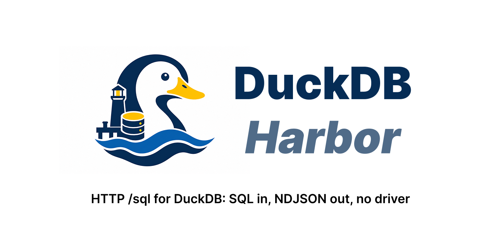

<p align="center">
  
</p>

# duckdb-harbor

> **Many clients, one DuckDB, over plain HTTP. `POST` a statement, read NDJSON
> back.**

Only one process can access a DuckDB file at a time. Harbor fixes that: it
puts a small server in front of the file so all your apps can share it — and
it feels exactly like the duckdb shell, except a database can also serve.

DuckDB Harbor is `harbor`, one small Rust binary with one grammar:

```console
$ harbor                       # what's running
$ harbor mydata.duckdb         # open it — REPL, or -c "SQL", or stdin
$ harbor mydata.duckdb serve   # serve it yourself, until you leave
```

`harbor mydata.duckdb` is the duckdb-shell muscle memory, kept: a REPL with
highlighting and completion, `-c` for one-shots, stdin for scripts. The
difference is what happens behind it — if nothing serves the file yet, a
server is spawned for it, and every other client of the same file joins that
server instead of hitting "database is locked". The two lifetimes, in one
breath: **bare, the server is everyone's — it lives while anyone is
connected; `serve`, the server is yours — it lives until you leave.**

## The Elevator Pitch

Two files. That's the entire install.

The library is DuckDB — all of it, one dynamic library, vanilla, compiled and
shipped by the DuckDB team. We never patch it, fork it, or wrap it in
bindings. Version hop = swap the file.

The binary is harbor: one 2.2MB executable that is both sides of the
conversation. As a server it loads libduckdb and serves your database over
HTTP, on a Unix socket or TCP. As a client it connects to any harbor and
gives you a modern shell — syntax highlighting, completion, history — in
place of the DuckDB CLI.

You never choose which one you're running. `harbor mydb.duckdb` connects if
the database is already being served, and spawns a server and connects to it
if it isn't. Your connection is the server's lifeline: the database stays
served while anyone is connected — a second client makes it two, your exit
makes it one — and when the last client leaves, the server checkpoints and
departs. Nothing to daemonize, nothing to clean up. (Want it to outlive its
clients? `harbor mydb.duckdb serve` — then it's yours until you stop it.)

While it's up, anything that speaks HTTP can query it: curl, your app,
another harbor.

`harbor` by itself shows what's being served.

No config file. No drivers, no ORM, no fleet manager. Built directly on
DuckDB's new v2 C API — the API of the 2.0 line — so it's smaller, faster, and
simpler than everything it replaces.

If it can speak HTTP and parse JSON, it can query your database.

```console
$ curl -s localhost:9495/sql -H 'Authorization: Bearer …' \
       -d '{"sql":"SELECT id, total FROM orders LIMIT 2"}'
{"type":"schema","columns":[{"name":"id","duckdbType":"BIGINT","lossless":true},
                            {"name":"total","duckdbType":"DECIMAL(10,2)","lossless":true,
                             "decimal":{"width":10,"scale":2}}]}
{"type":"row","values":[1,"19.99"]}
{"type":"row","values":[2,"4.50"]}
{"type":"end","rowCount":2,"timeMs":3}
```

One `schema` message, one `row` per row, one `end`. Rows go out as DuckDB
produces them, so a client can start on row one while the server is still
producing the last one.

Nine routes. That is the whole surface — two of them for queries, three so a
transaction can outlive one request, one to stop a statement that is running,
one to read the schema without asking five questions, one that says who a
server is, and one graceful shutdown route:

```
POST /sql                  run one statement, stream the result as NDJSON
                           (Accept: application/json for one document instead)
GET  /ready                can this server answer a query? no credential required
GET  /catalog              everything about the database in one stable JSON
                           document — schema, sizes, row estimates, DDL
                           (?style=lite for the cheap sketch)
GET  /info                 identity — database path, versions, pid, uptime,
                           and the live client count
DELETE /shutdown           authenticated drain, checkpoint, and stop
POST /sql/sessions/new     take a connection and hold it, for a transaction
DELETE /sql/sessions/<id>  give it back
GET  /sessions             what is holding one, and for how long
DELETE /sql/queries/<id>   stop a statement the caller named when it sent it
```

`POST /sql` streams by default. Send `Accept: application/json` and the same
result comes back as one document instead:

```json
{"ok":true,
 "columns":[{"name":"id","duckdbType":"INTEGER","lossless":true}],
 "data":[[1],[2]],
 "rowCount":2,
 "timeMs":3}
```

Same columns, same values, same encoder — only the framing differs. It is worth
asking for when the result is small and a single `JSON.parse` is simpler than
reading lines; it is the wrong choice for anything large, because a JSON
document is not valid until its last byte, so nothing can be flushed as it is
built. Harbor holds at most 32 MiB for one and refuses past that with a `406`
naming NDJSON as the remedy. Streaming has no such limit.

The one thing one-shot does better: since nothing has been sent when the last
row lands, a failure is still a real status code. The same query that streams a
`200` with an `{"type":"error"}` line at the end answers `400` in this shape.

The stream compresses on request — `Accept-Encoding: zstd`, the standard
coding browsers, newer curl, and Node/Bun offer on their own. The wrapped
bytes are the identical NDJSON: a 5M-row integer result measures 161MB
plain and 1.1MB as zstd, and when the query does any real work the
compression rides the writer thread for free. Anything else — gzip
included, its encoder would throttle the stream — gets identity, and
`curl -H 'Accept-Encoding: zstd' ... | zstd -d` recovers the stream
byte-for-byte.

`/ready` normally runs `SELECT 1` through an ordinary executor and answers `200
{"status":"ready"}` or `503`. Under sustained worker saturation, the dedicated
probe lane asks the control connection instead, so a load balancer can still
distinguish busy from dead. It is not a process-liveness check: a process can be
running while its database path is broken. Verdicts are cached for one second,
so polling costs at most one probe query per second however often it is asked.

## Stopping a statement

A statement that has entered DuckDB does not come back until it is done, and
harbor runs a small, bounded number at once. So a query nobody wants any more
is not a slow request — it is a connection out of service, and enough of them
are the whole server.

Name a statement when you send it, and you can stop it:

```console
$ curl -s localhost:9495/sql -H "$auth" \
       -d '{"sql":"SELECT count(*) FROM huge","queryId":"report-7"}' &
$ curl -s -X DELETE localhost:9495/sql/queries/report-7 -H "$auth"
{"cancelled":true}
```

When cancellation lands before streaming begins, the statement answers `499`
with `{"code":"cancelled"}` — nginx's code, because there is no standard one
for "the caller withdrew" and neither `400` nor `500` is true. If a streaming
response already began with `200`, cancellation arrives as its final NDJSON
error event instead; an HTTP status cannot be changed after its headers were
sent. Cancelling something that already finished is `{"cancelled":false}`, not
an error: by the time a Stop button is pressed, the query it refers to may well
be over.

The id is chosen by the caller rather than issued by harbor, and it has to be:
the response does not begin until the statement is streaming or done, so an id
in the reply would arrive too late to be any use. It is refused with a `409`
while a statement of that name is already running, so two live queries can
never share one name and make a cancel a coin flip.

**A deadline is the backstop.** `{"timeoutMs": N}` on a request, or
`HARBOR_STATEMENT_TIMEOUT_MS` for a whole deployment, stops a statement without
anyone having to ask. There is no default, deliberately: harbor streams
300,000-row results and is used for queries that take minutes on purpose, so a
default deadline would break correct programs to catch incorrect ones. With no
deployment cap, zero on a request means no limit. When a deployment cap is set,
it is a hard ceiling: a request may ask for less time, but neither a larger value
nor zero can opt out of the operator's limit.

Explicit cancellation remains reachable when every executor is inside a long
statement: after sustained saturation, a connection-free probe lane accepts
query cancellation, session release, readiness, and inspection requests. The
reaper is the independent backstop. It runs on its own thread and never touches
HTTP, so deadlines are still enforced if no cancellation request arrives or a
client disappears. If a deployment's worry is runaway queries rather than
impatient users, set `HARBOR_STATEMENT_TIMEOUT_MS` or
`--statement-timeout <duration>`.

Two smaller things follow from the same machinery. Releasing a session whose
statement is still running stops it — `{"released":false,"cancelling":true}`
— and the connection comes back on the reaper's next tick. And a lease that
blows its TTL while busy is reclaimed: the lease that most needs taking back
is the one wedged inside a runaway statement.

Cancelling a statement inside a transaction aborts that transaction, exactly as
it does in Postgres. Harbor does not paper over it — the next statement gets
`Current transaction is aborted (please ROLLBACK)` until you do. Rolling back
silently would let the statement after a cancellation commit in autocommit
under a client that still believed it was in a transaction.

## Transactions

A transaction lives on a connection and HTTP requests do not, so one request
per statement means no transaction can span two. A session bridges that: a
connection pinned to you until you commit, roll back, or stop answering.

```console
$ sid=$(curl -s localhost:9495/sql/sessions/new -H "$auth" | jq -r .sessionId)
$ post() { curl -s localhost:9495/sql -H "$auth" -d "{\"sql\":\"$1\",\"sessionId\":\"$sid\"}"; }
$ post "BEGIN"
$ post "INSERT INTO orders (total) VALUES (19.99) RETURNING id"
$ post "INSERT INTO order_items (order_id, price) VALUES (1, 19.99)"
$ post "COMMIT"
$ curl -s -X DELETE localhost:9495/sql/sessions/$sid -H "$auth"
```

This is PgBouncer's transaction pooling, or ActiveRecord checking a connection
out of its pool — with an HTTP request where they have a socket and a thread.
Three things follow from that, and they are the parts worth knowing:

**Sessions draw from their own connections.** `HARBOR_POOL_SIZE` (default 16)
is opened at load and split: the workers take theirs, sessions get the rest. A
pool serving both would run out of workers the moment enough clients held
transactions open, and then answer nothing at all. With none free, opening a
session is a `503` with `Retry-After` — queries keep working throughout.

**Every session has a deadline.** HTTP has no reliable close signal, so a
client that vanishes mid-transaction looks exactly like one that is thinking,
and a timer is the only way that connection ever comes back. Ask for a lifetime
with `{"ttlMs": N}`; harbor caps it at five minutes and answers with what it
granted, alongside the thirty-second idle timeout it enforces regardless. When
a session is reclaimed its transaction is rolled back, and so is one released
with a transaction still open.

**One statement at a time.** A second statement sent while the first is running
gets a `409`: a transaction is a sequence, and two of them interleaving inside
one is something no client could reason about.

`GET /sessions` shows what is held — age, idle time, statements, whether a
transaction is open — and the connection accounting behind it. Free plus live
plus in-flight always equals total; `balanced` is that checked at the moment
you asked. A pool leaks connections silently and the symptom shows up weeks
later as "everything hangs", so the arithmetic is worth being able to read.

Note that DuckDB resolves write conflicts optimistically: two transactions
touching the same row do not queue, the second is refused the moment it writes.
The answer is to run the transaction again, which is what `rip/db` does for
you.

## The whole database, one call

`GET /catalog` answers what a client would otherwise ask in a dozen queries:
every table with its columns, primary key, unique constraints, foreign keys,
indexes and sequences — plus the engine's row estimate and its own
`CREATE TABLE` rendering per table, and the database and WAL file sizes in
exact bytes at the top:

```json
{"harborVersion":"0.21.0","duckdbVersion":"v2.0.0-dev83323",
 "databaseSizeBytes":12582912,"walSizeBytes":0,
 "tables":[{"name":"orders","schema":"main","estimatedRows":300000,
            "columns":[…],"primaryKey":["id"],
            "ddl":"CREATE TABLE orders(id BIGINT PRIMARY KEY, …);"}, …],
 …}
```

The document is stable — same database, same bytes — so clients can diff it.
A client that only wants to paint a sidebar asks
`GET /catalog?style=lite` and gets the versions, the sizes, and
`{name, schema, estimatedRows}` per table: what exists and how big, without
how it is built, at a fraction of the bytes. An unknown style value is a loud
`400`; unknown parameters pass, which is what lets an older harbor answer a
newer client's ask with the full document instead of a 404.

## Get it running

One binary, and nothing to configure. The client half never touches DuckDB —
the engine (`libduckdb`) loads on demand, only when this process is the one
serving a file, so the same 2.2MB `harbor` is a pure protocol client on
machines that never host a database. `make fetch-duckdb` pulls DuckDB's
official artifacts into `~/.duckdb/cli/2.0.0/`, one of the places harbor
looks at runtime; then:

```console
$ make fetch-duckdb            # libduckdb + duckdb CLI -> ~/.duckdb/cli/2.0.0/
$ make harbor                  # -> target/release/harbor (no engine needed to build)
$ harbor mydata.duckdb
mydata>
```

`make bootstrap` does the whole thing in one shot — fetch the engine into
`~/.duckdb`, then build and install `harbor` into `~/.local/bin`. No step
needs root.

One caveat that ends at DuckDB 2.0 GA: the official artifact channel is
currently frozen at a build that predates the v2 C API, so the `libduckdb`
it delivers cannot *serve* (harbor says so plainly: "engine has no v2 C
API"). `fetch-duckdb` warns when this happens. Until GA, serving engines
come from this repo's own shelf — the Engine workflow builds all five
platforms from DuckDB source at CI's pinned commit and publishes them on
the `engine-<pin>` prerelease; `fetch-duckdb` takes it via `ENGINE_URL`,
and the release archives below already bundle it. The fetched `duckdb`
CLI is unaffected either way.

No toolchain? One command installs the latest release — it picks the right
archive for the platform, verifies its sha256 against the published checksums,
and installs `harbor` into `~/.local/bin` with `libduckdb` in `~/.local/lib`
(override with `BIN=...` `LIB=...`):

```bash
# macOS and Linux
curl -fsSL https://raw.githubusercontent.com/shreeve/duckdb-harbor/main/install.sh | bash

# Windows
irm https://raw.githubusercontent.com/shreeve/duckdb-harbor/main/install.ps1 | iex
```

Nothing there asks for root. `~/.local/bin` is where the XDG base directory
spec puts user executables; Debian and Fedora already have it on `PATH`, macOS
does not, and the installer says so rather than putting binaries somewhere you
cannot see. A system-wide install is `BIN=/usr/local/bin LIB=/usr/local/lib`
with `sudo` in front of the whole command — the installer never escalates on
its own. On Windows the binary lands in `%LOCALAPPDATA%\Programs\harbor\bin`,
which the installer adds to your user `PATH`.

Pin a version with `... | bash -s v0.21.0` (or `-Tag v0.21.0` on Windows). Each
[release](https://github.com/shreeve/duckdb-harbor/releases)
ships one self-contained archive per
platform (osx-arm64, linux-amd64, linux-arm64, windows-amd64, windows-arm64):
harbor and the exact DuckDB shared library it was tested against. Unix
archives carry `bin/`, `lib/` and `install.sh`; Windows archives put
`duckdb.dll` beside the executable and run in place.

### The two lifetimes

**`harbor <db.duckdb>` — the server is everyone's.** On a terminal it is the
REPL — highlighting, Tab completion, the duckdb-shell dot commands. With `-c`
or stdin it runs statements and exits. Either way, if nothing serves the file
yet, a server is spawned behind the scenes: detached, refcounted, alive while
anyone is connected. Every client holds one silent connection for its
lifetime, so a human thinking at a prompt counts as presence; when the last
client leaves, the server drains, `CHECKPOINT`s, sweeps its socket, and exits
a few seconds later. A second `harbor` on the same file — any spelling of the
same path — joins the same server instead of reporting "database is locked".

**`harbor <db.duckdb> serve` — the server is yours.** Foreground, no
refcount: it lives until you leave. On a terminal you get the same prompt,
dialled at the server's own socket, and `.quit` ends the server; headless it
runs until `SIGTERM`. Either exit is clean — drain, `CHECKPOINT` so the next
open never replays a WAL, socket swept. Boot persistence belongs to launchd
or a systemd user unit running exactly this command; harbor never becomes a
supervisor.

There is no registry and no config file. The socket **is** the registration:
its name is derived from the database's canonical path
(`~/.local/state/harbor/runtime/<basename>-<hash>.sock`), so discovery is
`readdir` plus a `GET /info` to each socket — which is precisely what bare
`harbor` prints:

```console
$ harbor
DATABASE            PID    CLIENTS  UPTIME  ADDRESS
~/Data/labs.duckdb  72840  2        3d      ~/.local/state/harbor/runtime/labs-1a2b3c4d.sock
```

A socket nothing answers on is a leftover from a `kill -9`, and the list
unlinks it. There is nothing else to clean up, because nothing else is
written. Set `HARBOR_HOME` (absolute path) to collapse everything harbor
writes — sockets and state alike — into that one directory instead; the
test suites use it to keep their servers out of the real fleet view.

### Sockets, TCP, and tokens

The unix socket is the default face, and the `0700` runtime directory is the
whole local access control — no token exists on a socket, and `--token` is
refused there so nobody believes an extra lock is doing something. TCP is the
one door that leaves the filesystem's protection, so `--port` makes `--token`
mandatory:

```console
$ harbor mydata.duckdb serve --port 9495 --token secret
$ harbor http://127.0.0.1:9495 --token secret -c "SELECT count(*) FROM orders"
```

Remote access is Caddy's job at the edge (TLS + auth); harbor itself speaks
plain HTTP over a unix socket or a loopback TCP port. A human reaches a
remote host over ssh and uses the socket.

A bearer token grants the ability to run SQL, and ordinary DuckDB SQL can
read host files or load extensions. For a server reachable by an untrusted
token holder, `--sealed` disables host-file access and community extensions.
`--max-temp-size` bounds disk spill, and `--statement-timeout` places the
hard statement ceiling described above. These are independent of Caddy's
transport and HTTP policy.

### Request logging

`--log` writes one line per HTTP request to stderr:

```
harbor: 2026-08-12T04:31:07Z 127.0.0.1 POST /sql 200 12ms
```

Timestamp, peer, method, path, status, duration — measured to the last body
byte rather than the first, so a slow query and a slow client both show. Off by
default. The SQL itself is never logged: it arrives in the request body, it can
be megabytes, and on this endpoint it is as likely to hold customer data as the
tables it reads.

stderr, not stdout, so it stays clear of anything a client reads. Send it
wherever the log belongs — `2>>/var/log/harbor.log`, a pipe, or a supervisor's
collector. There is no `--log FILE`: rotation and permissions are the shell's
job, and it does them better than harbor would.

## Any language

There is nothing to install on the client side. Shell:

```console
$ curl -sN localhost:9495/sql -H "Authorization: Bearer $TOKEN" \
       -d '{"sql":"SELECT count(*) FROM orders"}'
```

Python, standard library only — NDJSON means one message per line, so the
response reads as it arrives:

```python
import http.client, json

conn = http.client.HTTPConnection("127.0.0.1", 9495)
conn.request("POST", "/sql", json.dumps({"sql": "SELECT id, total FROM orders"}),
             {"Authorization": f"Bearer {token}"})

for line in conn.getresponse():
    msg = json.loads(line)
    if msg["type"] == "row":
        print(msg["values"])
```

JavaScript, with `fetch` — and `params`, which is how values are passed:

```js
const res = await fetch("http://127.0.0.1:9495/sql", {
  method: "POST",
  headers: {
    Authorization: `Bearer ${token}`,
    "Content-Type": "application/json",
  },
  body: JSON.stringify({ sql: "SELECT id, total FROM orders WHERE id > ?",
                         params: [100] }),
});

const decoder = new TextDecoder();
let pending = "";
for await (const chunk of res.body) {
  pending += decoder.decode(chunk, { stream: true });
  const lines = pending.split("\n");
  pending = lines.pop();
  for (const line of lines) {
    if (!line.trim()) continue;
    const msg = JSON.parse(line);
    if (msg.type === "row") console.log(msg.values);
  }
}
pending += decoder.decode();
if (pending.trim()) {
  const msg = JSON.parse(pending);
  if (msg.type === "row") console.log(msg.values);
}
```

## Performance

DuckDB answers the query; DuckDB Harbor's job is to stay out of the way. It
sustains tens of thousands of requests per second across concurrent clients
on a laptop, with sub-100µs round trips at low concurrency.

**harbor 0.13.0, DuckDB v2.0.0 nightly** (alpha38195), eight workers, pure
read path — `POST /sql` with `{"sql":"select 1"}` over keep-alive loopback
TCP, 10-second `oha` runs, every response a 200:

| clients | req/s | p50 | p99 |
|--:|--:|--:|--:|
| 1 | 10,914 | 0.09 ms | 0.12 ms |
| 4 | 28,167 | 0.14 ms | 0.22 ms |
| 16 | 44,079 | 0.24 ms | 0.61 ms |

The HTTP layer is not the ceiling: `GET /ready` — the same plumbing with no
SQL — measures ~99,000 req/s at 16 clients. Most of the per-request engine
cost is amortized by the per-connection prepared-statement cache (below);
0.13.0 also coalesced each response head into a single buffered write, set
`TCP_NODELAY`, and removed most per-request allocations from the HTTP layer.

An earlier, deliberately harsher benchmark — 20% `INSERT`s, every read
checked against an oracle, harbor 0.12.0 (no statement cache), **DuckDB
v1.5.5**, eight workers:

| clients | req/s | p50 | p95 | p99 | non-200 | wrong answers |
|--:|--:|--:|--:|--:|--:|--:|
| 1 | 3,269 | 0.20 ms | 0.58 ms | 0.74 ms | 0 | 0 |
| 4 | 7,012 | 0.50 ms | 1.18 ms | 1.40 ms | 0 | 0 |
| 16 | 9,096 | 1.66 ms | 2.90 ms | 3.60 ms | 0 | 0 |

Mean of five 10-second runs per level on an idle M-series laptop, connections
reused, throughput taken from wall-clock across the level rather than summed
from per-request timings. Run-to-run spread was under 4% at every level.

The engine version belongs beside the numbers, because it moves them. The same
harbor build on a **v2.0.0** nightly gets roughly half this on small statements
— 1,352 / 3,667 / 4,739 req/s at the same three levels (alpha37626; still true
of alpha38195). That is not a debug build and it is not harbor. It is v2's [new
PEG parser](https://duckdb.org/2026/08/20/duckdb-20-peg-parser), plus a small
fixed cost per execute — measured by driving each engine directly, no server:
re-executing an already-prepared statement costs +11 µs on v2, while parsing
fresh SQL text costs about 2× v1.5.5, growing with statement size. Execution
itself is at parity or faster (bulk CTAS is quicker on v2 than on 1.5.5).
Before 0.13.0 harbor parsed every request's SQL fresh, paying the parser on
every statement; that was the whole gap. Since 0.13.0 each executor
connection keeps an LRU of prepared statements keyed by statement text, so a
repeated statement skips parse and plan entirely — which is why the pure-read
numbers above sit where they do on a v2 engine. First-seen statement texts
still pay the parser once; upstream is still optimizing it pre-GA, and real
analytical queries never notice either way. Measure against the engine you
deploy.

Every read in the mixed run was checked against an answer taken from the database
file before the server opened it — a benchmark whose oracle is the server it is
benchmarking cannot detect a server that is consistently wrong.

Streaming matters more than the rate for large results. A 300,000-row result
starts arriving in single-digit milliseconds — before the query has finished
running — and completes in well under 100 ms, because nothing is buffered. A
client can start work on row one while the server is still producing row
300,000. (Whether the *query* materialises is DuckDB's business: `ORDER BY`,
hash aggregates and joins all build state first.)

Many connections, few queries: DuckDB Harbor accepts many concurrent
connections and executes a small, bounded number of statements — six by
default, settable with `--workers`. DuckDB parallelises a *single* query across
every core, so running hundreds at once produces thrashing, not throughput. A
request normally waits for a worker. If every worker has been inside a
statement for at least 250 ms, the dedicated probe lane keeps control routes
responsive and may shed new `/sql` or `/catalog` work with a retryable `503`
instead of hiding an unbounded queue behind saturated analytics.

## Why it looks like this

**Plain HTTP, on purpose.** It binds loopback and speaks HTTP, not HTTPS. TLS
belongs at the edge, where certificates, renewal, and HTTP/2 and /3 are already
solved by software that does nothing else. Put Caddy or nginx in front and
terminate there.

**One statement per request.** A second statement is rejected with `400`, and
that check is load-bearing rather than decorative: the Rust DuckDB client
*executes* every statement but the last while merely preparing one, so anything
that gets past it runs. Use `params` for values.

**Types survive the trip.** Every column carries its `duckdbType`, plus width
and scale for `DECIMAL` and nested `child`/`fields` for `LIST` and `STRUCT`, so
a typed client can reconstruct exactly what DuckDB had rather than a lossy JSON
approximation. Values JSON cannot hold exactly are quoted rather than emitted
as bare numbers, so an integer past 2^53 does not silently reprecision in a
JavaScript client. Where something genuinely cannot survive, the column says so
with `"lossless": false` instead of returning a plausible wrong answer.

## Where it fits

DuckDB's ecosystem already covers DuckDB talking to DuckDB. DuckDB Harbor
covers everyone else.

| Serves | Client needs |
| --- | --- |
| `quack` — other DuckDB instances | DuckDB |
| **`harbor` — everything else** | **`curl`** |

`quack` is a DuckDB extension; `harbor` is a standalone server. It can
still load an extension into its own database with
`harbor db.duckdb serve --unsigned --init 'LOAD <ext>'`, so one process can
answer HTTP clients and other DuckDB instances over one file at once. Harbor
ships no extension of its own — whatever `LOAD` resolves by name in `~/.duckdb`
is what it gets, matching that to the loaded engine is the operator's call, and
Harbor does not patch extension source while loading it. For a desktop face on
Harbor servers, [DuckTable](../ducktable/) is the
native client, developed in this repository beside harbor.

## Known limitations

**`TIME WITH TIME ZONE` loses its offset.** DuckDB's Arrow exporter discards it
before DuckDB Harbor sees the value, so times at different offsets become
indistinguishable. The column is marked `"lossless": false` rather than
returning a time that silently means something else. Recover the offset with
`date_part('timezone', t)`, or cast to `VARCHAR`.

**`TIME_NS` and `VARIANT` are refused with `400`.** Neither can cross the Arrow
boundary the Rust client uses. Cast to `VARCHAR` and the value comes back
intact.

**Bodies are capped at 8 MiB**, declared or delivered; over that is a `413`.
There is no rate limiting and no CORS — defensible for a service behind a proxy,
worth knowing before it faces a browser. Request logging is available with
`--log`, off by default.

**Windows serves over loopback TCP only.** Unix sockets — and with them
spawn-on-use and the list — are a unix feature. On Windows, serving is
explicit (`harbor <db> serve --port <p> --token <t>`) and the client half
works the same everywhere.

**The engine is the loaded `libduckdb`, not the binary.** Nothing is linked:
harbor loads the engine on demand (`HARBOR_LIBDUCKDB`, then `../lib` beside
the binary, `~/.local/lib`, and `~/.duckdb/cli/*` — DuckDB's own world,
disposable and refetchable). Harbor binds DuckDB's v2 C API, so DuckDB 2.0
is the engine floor; the same build has been verified against every
v2-API engine it has met (currently built at CI's pinned commit and shelved
on the `engine-<pin>` prerelease — the official artifacts are frozen
pre-v2-API until GA). Treat that as tested
compatibility, not a
promise that an arbitrary future DuckDB ABI will work. Your database files
need no such care: a file created by a 1.5-era DuckDB opens as-is, because
2.0's storage layer reads it. A machine with
no engine at all still runs the client half; only serving needs the library,
and the error says exactly where it looked.

## Working on it

Building is only needed to change it. The workspace has four first-party
crates:

- **`harbor`** — the server engine, the client (`src/repl/`, which never
  touches DuckDB), and the CLI, all in one binary;
- **`harbor-common`** — paths, names, permissions, durations: the vocabulary
  shared with DuckTable so the two cannot drift;
- **`wire`** — protocol request and response types consumed by the client
  half; and
- **`justhttp`** — Harbor's small synchronous HTTP/1.1 server over TCP and
  Unix sockets.

The server implements its protocol shapes directly rather than depending on
`wire`, so a wire change needs tests on both sides; drift is not a Rust
compile error. Nothing links `libduckdb` — the engine loads on demand — so no
DuckDB source tree, library, or header is required to build: `make harbor`
works on a bare machine, and `make fetch-duckdb` fetches the duckdb CLI plus
a library (see the GA caveat under "Get it running" — until then a serving
engine is built at CI's pin). The crate ships pregenerated bindings, so
there is no bindgen.

`make unit` runs the fast Rust tests and `make test` runs the full suite. The
full suite expects `sample.duckdb`; create it with
`test/scripts/fixture.sh sample.duckdb` when it is absent. CI performs that
fixture step explicitly. The twelve suites use independent oracles where answers
need comparison — values read from the database file before the server takes
the lock, and Python's own `datetime` and `base64` for fuzzed values. An oracle
that shares an implementation with the thing it checks confirms only that the
code is self-consistent.

## Status

Pre-production. One small binary. Nothing is linked: harbor loads a DuckDB
2.0+ `libduckdb` at runtime — the v2 C API is the floor — and database files
from 1.5-era DuckDBs open as-is. Deploy remote TCP behind Caddy, which owns
TLS and edge request
policy; Harbor independently owns SQL statement deadlines.

## License

MIT.
